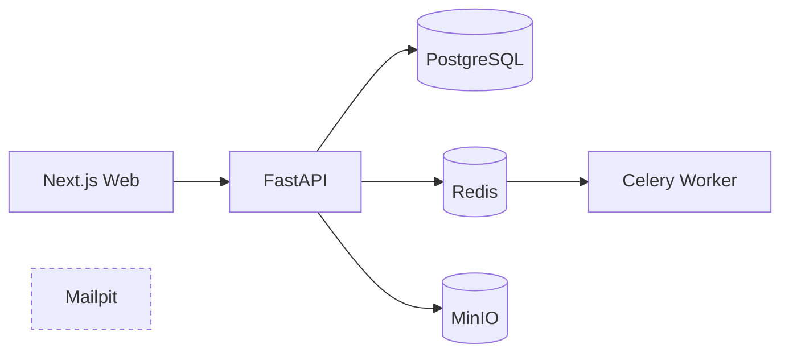

# Arsitektur Fase 0

Fase 0 membangun batas layanan dan fondasi tenancy sebelum alur dokumen MVP 1.

## Keputusan

- `business_id` menjadi batas tenant pada seluruh entitas bisnis.
- JWT hanya memuat identitas pengguna; bisnis aktif dan role selalu diverifikasi
  kembali melalui membership di database.
- API, worker, dan seed memakai package Python yang sama.
- Migration Alembic adalah sumber schema database. Pembuatan schema langsung hanya
  diizinkan pada environment test berbasis SQLite.
- Health readiness memeriksa database, Redis, object storage, dan worker.
- Kredensial pada `.env.example` hanya untuk data sintetis lokal dan wajib diganti
  untuk deployment non-demo.

## Batas Fase 0

Belum ada upload, ekstraksi AI, ledger, approval, rekonsiliasi, atau pengiriman
pesan. Komponen-komponen tersebut sengaja menunggu exit gate dan persetujuan MVP 1.
