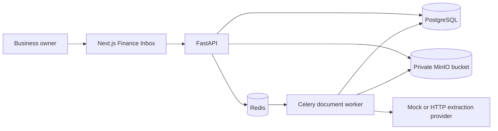

# System Architecture

## Document flow

1. The API authenticates the user, validates the file signature, writes it to a
   tenant-prefixed private object key, and stores document metadata.
2. The API returns the document identifier before background extraction starts.
3. Celery records each workflow step, validates structured provider output, runs
   deterministic finance checks, and searches for duplicates.
4. A valid document becomes a balanced draft journal and an approval request.
5. The owner reviews the extracted fields and account category.
6. An idempotent posting transaction marks the journal final and updates the
   financial summary.

## Trust boundaries

- `business_id` scopes all finance entities and queries.
- JWT business and user claims are insufficient on their own; membership and role
  are loaded from the database.
- Uploaded bytes and extracted text are untrusted input.
- Provider output must match a strict schema and pass deterministic validation.
- The extraction provider cannot post journals or execute tools.
- Source files stay private and are fetched through an authenticated API endpoint.
- Only posted, balanced journals contribute to dashboard totals.
- Audit events record system steps and human decisions with correlation IDs.

## Runtime

The API, worker, and seed share the same Python package. Alembic owns production
schema changes, while direct schema creation is restricted to isolated SQLite
tests. Health checks cover PostgreSQL, Redis, private object storage, the worker,
and the web application.
